# Text Recognition on Cross Domain Datasets
Improved CRNN,ASTER,DAN on different text domains like scene text, hand written, document, chinese/english, even ancient books

# ATTENTION 😮❗😮❗😮❗
This is an experimental project, and the framework is changed every time i uploaded.(Sorry for my mess. I should progame this in a more structured way). Any way, you have to redownload this project every time I uploaded it. So that you can successfully run the code. Thanks for your Attention.🙇‍♂️🙇‍♂️
****
# Update🙂🙂
|Date|Description|
|----|----|
|7/30|Checkpoint for CRNN on IAM dataset has been released. You can test your English handwritten now|
|7/31|Checkpoint for CRNN on CASIA-HWDB2.x has been released. You can test your Chinese handwritten now|
|8/3|New Algorithms! ASTER is reimplemented here and checkpoint for scene text recognition is released|
|8/5|Checkpoint for ASTER on IAM dataset has beem released. It's much more accurate than CRNN due to attention model's implicit semantic information. You should not miss it😃|
|8/8|New Algorithms! DAN(Decoupled attention network) is reimplented. checkpoint forb both scene text and iam dataset are realesed|
****
# 1. Welcome!😃😃
Now I'm focusing on a project to build a general ocr systems which can recognize different text domains. From scene text, hand written, document, chinese, english to even ancient books like confucian classics. So far I don't have a clear idea about how to do it, but let's just do it step by step. This repository is suitable for greens who are interesed in text recognition(I am a green too😂).
****
# 2. Contents👨‍💻👨‍💻
|Part|Description|
|----|----|
|Datasets|[Multible datasets in lmdb form](#Datasets)|
|Alogrithms|[CRNN](#Algorithms)|
||[ASTER](#ASTER)|
||[DAN](#DAN)|
|Train|[Train](#Train)|
|Test|[Test](#Test)|
|Inferrence|[Inferrence](#Inferrence)|
****
# Datasets
## 3.1 Scene Text Recognitons
### 3.1.1 Training Sets(Synthetic)
|Dataset|Description|Examples|BaiduNetdisk link|
|----|----|----|----|
|SynthText|**9 million** synthetic text instance images from a set of 90k common English words. Words are rendered onto nartural images with random transformations||[Scene text datasets(提取码:emco)](https://pan.baidu.com/s/1PBJf-BtFa7mLkltIfTXPhQ)|
|MJSynth|**6 million** synthetic text instances. It's a generation of SynthText.||[Scene text datasets(提取码:emco)](https://pan.baidu.com/s/1PBJf-BtFa7mLkltIfTXPhQ)|
****
### 3.1.2 Evaluation Sets(Real, and only provide test set)
|Dataset|Description|Examples|BaiduNetdisk link|
|----|----|----|----|
|IIIT5k-Words(IIIT5K)|**3000** test images instances. Take from street scenes and from originally-digital images||[Scene text datasets(提取码:emco)](https://pan.baidu.com/s/1PBJf-BtFa7mLkltIfTXPhQ)|
|Street View Text(SVT)|**647** test images instances. Some images are severely corrupted by noise, blur, and low resolution||[Scene text datasets(提取码:emco)](https://pan.baidu.com/s/1PBJf-BtFa7mLkltIfTXPhQ)|
|StreetViewText-Perspective(SVT-P)|**639** test images instances.  It is specifically designed to evaluate perspective distorted textrecognition. It is built based on the original SVT dataset by selecting the images at the sameaddress on Google Street View but with different view angles. Therefore, most text instancesare heavily distorted by the non-frontal view angle.||[Scene text datasets(提取码:emco)](https://pan.baidu.com/s/1PBJf-BtFa7mLkltIfTXPhQ)|
|ICDAR 2003(IC03)|**867** test image instances||[Scene text datasets(提取码:mfir)](https://pan.baidu.com/s/1PBJf-BtFa7mLkltIfTXPhQ)|
|ICDAR 2013(IC13)|**1015** test images instances||[Scene text datasets(提取码:emco)](https://pan.baidu.com/s/1PBJf-BtFa7mLkltIfTXPhQ)|
|ICDAR 2015(IC15)|**2077** test images instances. As text images were taken by Google Glasses without ensuringthe image quality, most of the text is very small, blurred, and multi-oriented||[Scene text datasets(提取码:emco)](https://pan.baidu.com/s/1PBJf-BtFa7mLkltIfTXPhQ)|
|CUTE80(CUTE)|**288** It focuses on curved text recognition. Most images in CUTE have acomplex background, perspective distortion, and poor resolution||[Scene text datasets(提取码:emco)](https://pan.baidu.com/s/1PBJf-BtFa7mLkltIfTXPhQ)|
****
## 3.2 Hand Written
|Dataset|Description|Examples|BaiduNetdisk link|
|----|----|----|----|
|IAM|IAM dataset is based on **handwritten English** text copied from the LOB corpus. It contains 747 documents(**6,482 lines**) in the training set, 116 documents (**976 lines**)in the validation set and 336 documents (2,915 lines) in the testing set|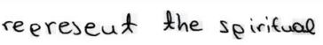|[IAM_line_level(提取码:u2a3)](https://pan.baidu.com/s/1JqKWHebquezhxtdO8z4Q1Q)|
|CASIA-HWDB2.x|CASIA-HWDB is a large-scale **Chinese hand-written** database.|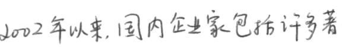|[HWDB2.x(提取码:ozqu)](https://pan.baidu.com/s/1X-uhmR1i9mWXOGQ9LGjJVA)|

****
# Algorithms
## 4.1 CRNN
### 4.1.1 On Scene Text
- I reimplemented the most classic and wildly deployed algorithm CRNN. The orignal backbone is replaced by a modifyied ResNet and the results below are trained on MJ + ST.

|#|IIIT5K|SVT|IC03|IC13|IC15|SVTP|CUTE|
|----|----|----|----|----|----|----|----|
|CRNN(reimplemented)|**91.2**|**84.4**|**90.8**|**88.0**|**73.1**|**71.8**|**77.4**|
|CRNN(original)|78.2|80.8|89.4|86.7|-|-|-|

- Some recognion results

|Image|GT|Prediction|
|----|----|----|
||I am so sorry|'iamsosory'|
|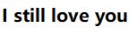|I still love you|'istilloveyou'|
|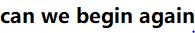|Can we begin again|'canwebeginagain'|

- note that we only predict 0-9, a-z. No upper case and punctuations. If you want to predict them, you can modify the code
****
### 4.1.2 On Handwritten
- Relative experiments are conducted on IAM dataset and CASIA-HWDB

|Dataset|Word Accuracy|
|----|----|
|IAM(line level)|67.2|
|CASIA-HWDB2.0-2.2|88.6|

- Some recognion results

|Image|GT|Prediction|
|----|----|----|
|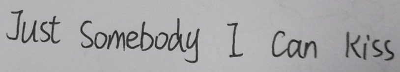|Just Somebody I Can Kiss|'Just Somebody I can kiss'|
|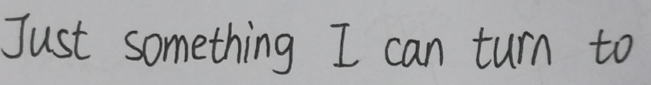|Just something I can turn to|'Just something I can turn to'|
|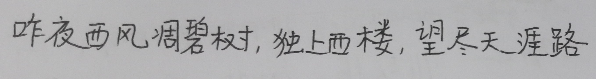|昨夜西风凋碧树，独上西楼，望尽天涯路。|'昨夜西风调瑟树,独上西楼。望尽天涯路'|
|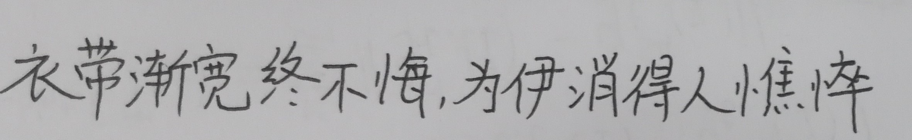|衣带渐宽终不悔，为伊消得人憔悴|'衣带渐宽终不海,为伸消得人憔悴'|
|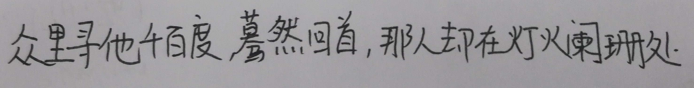|众里寻他千百度，蓦然回首，那人却在灯火阑珊处|'众里寻他千百度,暮然回首,那人却在灯火闻班然'|
|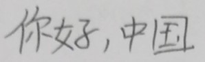|你好，中国|'你好，中国'|
|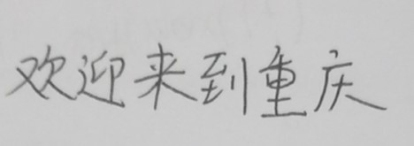|欢迎来到重庆|'欢迎来到重庆'|
|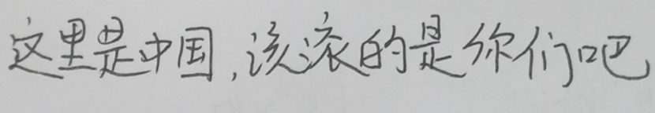|这里是中国，该滚的是你们吧|'这里是中国,该派的是你们吧'|
- Chinese handwritten are sufferd from imbalanced words contribution. So sometimes it's hard to recognize some rare words 
****
## 4.2 ASTER
### 4.2.1 On Scene Text
- ASTER is a classic text recognition algorithms with a **TPS rectification network** and **attention decoder**.

|#|IIIT5K|SVT|IC03|IC13|SVTP|CUTE|
|----|----|----|----|----|----|----|
|ASTER(reimplemented)|**92.9**|88.1|91.2|88.6|**78.3**|**78.5**|
|ASTER(original)|91.93|**88.76**|**93.49**|**89.75**|74.11|73.26|

- Some recognion results

|Image and Rectified Image|GT|Prediction|
|----|----|----|
||COLLEGE|'COLLEGE'|
||FOOTBALL|'FOOTBALL'|
|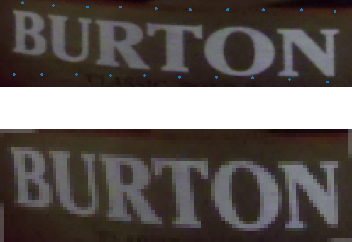|BURTON|'BURTON'|

****
### 4.2.2 On Handwritten
- Relative experiments are conducted on IAM dataset and CASIA-HWDB

|Dataset|Word Accuracy|
|----|----|
|IAM(line level)|69.8|
|CASIA-HWDB2.0-2.2|The model fails to convergence and I am still training|

- Some recognion results

|Image|GT|Prediction|
|----|----|----|
|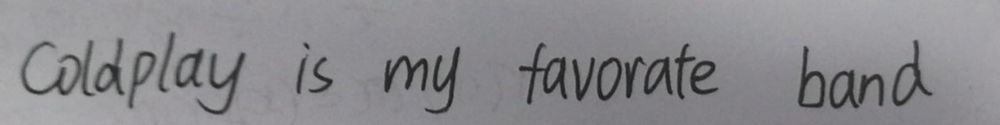|Coldplay is my favorate band|'Coldplay is my favorate band'|
|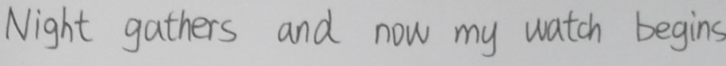|Night gathers and now my watch begins|'Night gathers and now my watch begins'|
|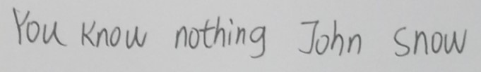|You konw nothing John Snow|'You konw nothing John snow'|
****
****
## 4.3 DAN
### 4.3.1 On Scene Text

### 4.3.2 On Handwritten
- Relative experiments are conducted on IAM dataset and CASIA-HWDB

|Dataset|Word Accuracy|
|----|----|
|IAM(line level)|74.0|
|CASIA-HWDB2.0-2.2||

- Some recognion results

|Image|Prediction|
|----|----|
|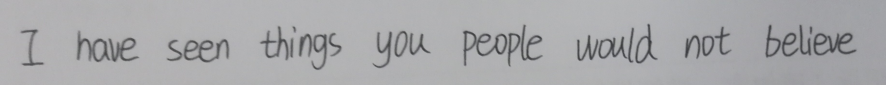|'I have seen things you people would not believe lift'|
|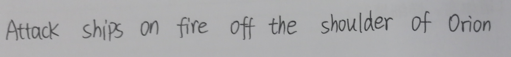|'Attack ships on fire off the shoulder of Orien'|
|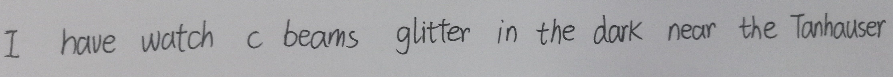|'I have watch  bearans gitter in the does near the Tarhouser'|
|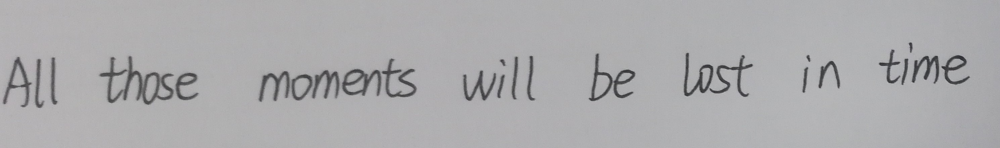|'All those moments will be lost in time'|
|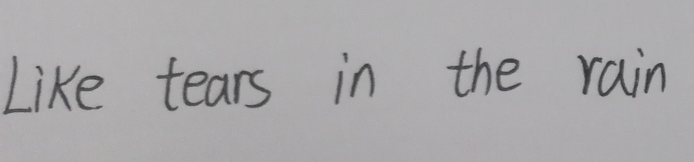|'like tears in the rain'|
****
# Train
## 5.1 CRNN
### 5.1.1 Train CRNN on Scene Text
- modify `scripts/CRNN/scene_text/train.sh`. Set up training set path and evaluation set path.
- run 
```Bash
bash scripts/scene_text/train.sh
```
- If you want to predict more characters, add a line in `scripts/train.sh`
 ```Bash
-- alphabets 0123456789abcdefghijklmnopqrstuvwxyzABCDEFGHIJKLMNOPQRSTUVWXYZ \
or
-- alphabets 0123456789abcdefghijklmnopqrstuvwxyzABCDEFGHIJKLMNOPQRSTUVWXYZ!"#$%&'()*+,-./:;<=>?@[\]^_`{|}~ \
```
### 5.1.2 Train CRNN on IAM dataset
- modify `scripts/CRNN/iam_dataset/train.sh`. Set up training set path and evaluation set path.
- run 
```Bash
bash scripts/CRNN/iam_dataset/train.sh
```
### 5.1.3 Train CRNN on CASIA_HWDB dataset
- modify `scripts/CRNN/CASIA_HWDB/train.sh`. Set up training set path and evaluation set path.
- run 
```Bash
bash scripts/CRNN/CASIA_HWDB/train.sh
```
****
## 5.2 ASTER
### 5.1.1 Train ASTER on Scene Text
- modify `scripts/ASTER/scene_text/train.sh`. Set up training set path and evaluation set path.
- run 
```Bash
bash scripts//ASTER/scene_text/train.sh
```
### 5.12 Train ASTER on IAM dataset
- modify `scripts/ASTER/iam_dataset/train.sh`. Set up training set path and evaluation set path.
- run 
```Bash
bash scripts//ASTER/iam_dataset/train.sh
```
# Test
## 6.1 Test CRNN
### 6.1.1 Test CRNN on Scene Text
- DownLoad Pretrained Checkpoints, [CRNN on STR, Checkpoints(提取码:axf7)](https://pan.baidu.com/s/1Ik6d9aiN8HFCe57pha0Gsg)
- modify `scripts/CRNN/scene_text/test.sh`. Set up test_data_dir and resume for the checkpoint
- run 
```Bash
bash scripts/CRNN/scene_text/test.sh
```
### 6.1.2 Test CRNN on IAM dataset
- DownLoad Pretrained Checkpoints, [CRNN on IAM, Checkpoints(提取码:3ajw)](https://pan.baidu.com/s/1_XUzvqgDy4HtRv2F6N34og)
- modify `scripts/CRNN/iam_dataset/test.sh`. Set up test_data_dir and resume for the checkpoint
- run 
```Bash
bash scripts/CRNN/iam_dataset/test.sh
```
### 6.1.3 Test CRNN on CASIA_HWDB dataset
- DownLoad Pretrained Checkpoints, [CRNN on CASIA_HWDB, Checkpoints(提取码:ujpy)](https://pan.baidu.com/s/1AfWdvW9ShS09BIiBTIpa4Q)
- modify `scripts/CRNN/CASIA_HWDB/test.sh`. Set up test_data_dir and resume for the checkpoint
- run 
```Bash
bash scripts/CRNN/CASIA_HWDB/test.sh
```
## 6.2 Test ASTER
### 6.1.1 Test ASTER on Scene Text
- DownLoad Pretrained Checkpoints, [ASTER on STR, Checkpoints(提取码:mcc9)](https://pan.baidu.com/s/1jMfLwRJrcfk7IQ5_NDw3-g)
- modify `scripts/ASTER/scene_text/test.sh`. Set up test_data_dir and resume for the checkpoint
- run 
```Bash
bash scripts/ASTER/scene_text/test.sh
```
### 6.1.2 Test ASTER on IAM dataset
- DownLoad Pretrained Checkpoints, [ASTER on IAM, Checkpoints(提取码:mqqm)](https://pan.baidu.com/s/1CwxJFKDziZu1dlJCe1gHPg)
- modify `scripts/ASTER/iam_dataset/test.sh`. Set up test_data_dir and resume for the checkpoint
- run 
```Bash
bash scripts/ASTER/iam_dataset/test.sh
```
# Inferrence
## 7.1 CRNN
### 7.1.1 Inferrence CRNN on Scene Text
- DownLoad Pretrained Checkpoints, [CRNN on STR, Checkpoints(提取码:o4mb)](https://pan.baidu.com/s/1aHiU1mDvYD5gs2G9Zr3JjQ)
- modify `scripts/CRNN/scene_text/inferrence.sh`. Set up image_path and resume for the checkpoint
- run 
```Bash
bash scripts/CRNN/scene_text/inferrence.sh
```
### 7.1.2 Inferrence CRNN on IAM dataset
- DownLoad Pretrained Checkpoints, [CRNN on IAM, Checkpoints(提取码:3ajw)](https://pan.baidu.com/s/1_XUzvqgDy4HtRv2F6N34og)
- modify `scripts/CRNN/iam_dataset/inferrence.sh`. Set up image_path and resume for the checkpoint
- run 
```Bash
bash scripts/CRNN/iam_dataset/inferrence.sh
```
### 7.1.3 Inferrence CRNN on CASIA_HWDB dataset
- DownLoad Pretrained Checkpoints, [CRNN on CASIA_HWDB, Checkpoints(提取码:ujpy)](https://pan.baidu.com/s/1AfWdvW9ShS09BIiBTIpa4Q)
- modify `scripts/CRNN/CASIA_HWDB/inferrence.sh`. Set up image_path and resume for the checkpoint
- run 
```Bash
bash scripts/CRNN/CASIA_HWDB/inferrence.sh
```
****
## 7.2 ASTER
### 7.2.1 Inferrence ASTER on Scene Text
- DownLoad Pretrained Checkpoints, [ASTER on STR, Checkpoints(提取码:mcc9)](https://pan.baidu.com/s/1jMfLwRJrcfk7IQ5_NDw3-g)
- modify `scripts/ASTER/scene_text/inferrence.sh`. Set up image_path and resume for the checkpoint
- run 
```Bash
bash scripts/ASTER/scene_text/inferrence.sh
```
### 7.1.2 Inferrence ASTER on IAM dataset
- DownLoad Pretrained Checkpoints, [ASTER on IAM, Checkpoints(提取码:mqqm)](https://pan.baidu.com/s/1CwxJFKDziZu1dlJCe1gHPg)
- modify `scripts/ASTEriam_dataset/inferrence.sh`. Set up image_path and resume for the checkpoint
- run 
```Bash
bash scripts/ASTER/iam_dataset/inferrence.sh
```
